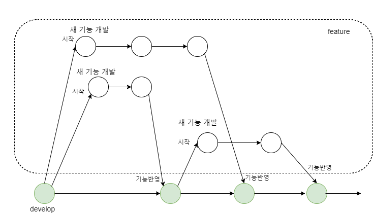
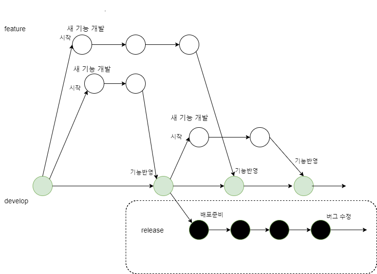
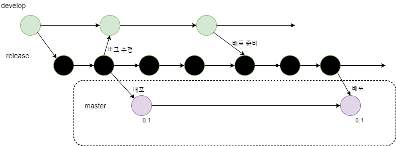
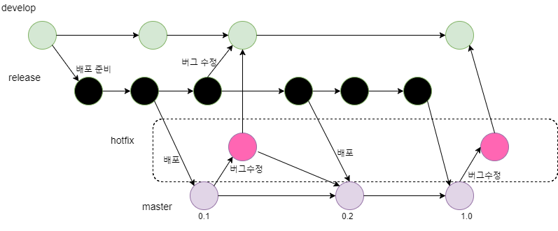

#### 커밋 단위
; 커밋의 내용을 최소 단위(Atomic)로 유지

- 커밋 하나는 하나의 의도와 의미만 가짐  
(한번에 여러 파일 수정해도 그 의도는 단 하나여야 함)
- 파일을 하나만 수정하더라도 두 개 이상의 의도가 있다면 하지 말기  
(버그 수정과 새 기능추가를 동시에 하지 않아야 하는 것)

#### 커밋 메시지 작성 규칙

<pre>
[category] - [simple message]
[detailed description]
</pre>

**category**  

<table>
  <tr>
    <th>이름</th> <th>설명</th>
  </tr>
  <tr>
    <td>fix</td> <td>잘못된 부분 수정</td>
  </tr>
  <tr>
    <td>add</td> <td>기능 추가</td>
  </tr>
  <tr>
    <td>mod</td> <td>코드 수정</td>
  </tr>
  <tr>
    <td>rm</td> <td>기능 삭제</td>
  </tr>
</table>

**message**  
; 영문 기준 70자 정도(일반적인 터미널 글자 수 고려)

**detailed description**  
자세한 내용 기술  
- 왜 커밋했는지 설명
- 버그 수정의 경우 원래 어떤 문제가 있었는지 설명
- 사용 중인 이슈 트래커가 있다면 해당 이슈의 하이퍼링크를 포함

#### 브랜치 이름 작성 규칙

> 브랜치 이름 작성 규칙의 예 (아래 표와 같이 가정)

<table>
  <tr>
    <th>이름</th> <th>설명</th>
  </tr>
  <tr>
    <td>new</td> <td>새 기능 추가가 목적인 브랜치</td>
  </tr>
  <tr>
    <td>test</td> <td>무언가를 테스트하는 브랜치(새 라이브러리, 배포 환경, 실헐 등)</td>
  </tr>
  <tr>
    <td>bug</td> <td>버그 수정이 목적인 브랜치</td>
  </tr>  
</table>

> exmple (구분자로는 / )

<pre>
  new/feat-foo
  new/feat-bar
  bug/critical-thing
  test/awesome-new-library
</pre>

> 주의  

- 사람이 한번에 알아볼 수 없는 이름(e.g : 숫자로만 된 이름)
- 너무 긴 설명조의 이름

#### 태그와 버전 이름 작성 규칙

> x.y.z

- x : 기존과 호환이 되지 않는 변경이 발생할 때 증가
- y : 기존과 호환이 되며, 새로운 기능이 추가 될 때 증가
- z : 기존과 호환이 되며, 버그 수정등이 될 때 증가

#### 프로젝트 유형별 협업 흐름

<a href="#git-flow">git-flow</a>

##### git-flow

; develop, feature, release, master, hotfix

> develop 브런치  

; 하나만 존재. 브랜치에 병합되는 것은 feature 브랜치, release, hotfix의 버그 수정  

>  feature 브런치  
; develop 브랜치를 기반으로 새로운 기능 개발이나 버그 수정 담당  
(오직 develop 브렌치에 병합될 떄만 관계성이 생김)  

> release 브런치  
; develop 브랜치에서 갈라져 나와서 배포 준비를 하는 브랜치.  
(온리 버그 수정 :: feature/bugs -> develop -> release)

> master 브런치  
;실제 배포되는 버전이 있는 브랜치  
(release, hotfix 브랜치하고만 관계를 가짐)

> hotfix 브랜치  
; master i.e 현재 배포 중인 코드에 버그가 있어 급히 수정할 때

    
p
